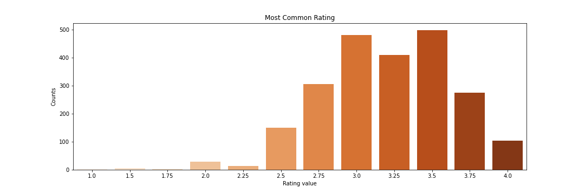
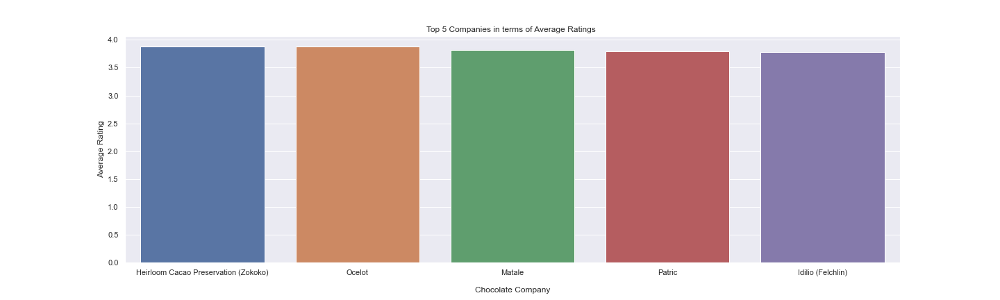

# Chocolate

**Authors**: Daniel Blake, Andrew Calkins, Colette Crowder

## Summary

We created a model that uses a combination of factors to determine if a chocolate bar is more or less likely to be rated highly.
Because highly rated bars are more likely to succeed financially, this model ensures that the money of potential chocolate investors goes to the right places.

## Data

We got our primary dataset from flavorsofcocoa.com. The dataset contains information about more than 2,400 dark chocolate bars, including:
manufacturer, company location, year of review, country of bean origin, cocoa percent, ingredients used, most memorable characteristics (a subjective, descriptive review), and chocolate bar ratings
Because cocoa beans play a huge role in the production of chocolate, especially the higher-end, craft chocolate in our dataset, we also gathered climate data (by country). We matched this climate data to the country of bean origin for each chocolate bar. 
Our climate data included latitude and longitude, annual average precipitation, and annual average temperature (all important factors for growing cocoa beans).

## Methods

### Visual 1

In our data analysis we have a lot of Exploritory data analysis or EDA. This EDA is what we used to decide on a buisness problem. the above model shows the average rating of the chocolate over the last 15 years. while the graphs below explain average rating and the top5 companies based off of either average ratings or number of chocolate bars produced. We used these EDA's to determain that our buisness question would be to determain what factors make a succesful choclate bar. We decided that a succesful chocolate bar has a rating of 3 or higher. This allowed us to use many diffrent models to try and get the best training score for our model and predict what makes the best candy bar. 

### Visual 2

### Visual 3

### Visual 4

## Results

While we had a lot of difficulty raising the preformance with 7 bins, after switching to binary results our precision was able to rise easily. In the end by testing various hyper parameters with SVM, Random Forest and KNN we dound a random forest classifier was able to preform best, with a precision of 85-90%.

### Visual 5

## Conclusions

For future analyses, we would collect more data. 
Because our project is geared towards those who want to invest in chocolate bars, it would make sense to look into industrial/commercial chocolate, too (Hershey’s, Kit Kat, Twix, etc.). Investing in a cheaper chocolate intended for a wider audience could be a profitable endeavor. 
Additionally, our dataset only focused on dark chocolate. It could be beneficial to incorporate other types of chocolate, such as milk and white chocolate, into future models. 
We would also like to gather additional ingredient and manufacturer information. 
We have an interest in gathering chocolate bar ratings from other sources, as well. Our dataset featured anonymous ratings, meant to focus on the specific flavors of the chocolate. Perhaps asking a typical consumer to rate a chocolate bar could yield different and enlightening results.
Collecting profit data would also be a priority for future projects (how much a chocolate bar sells for, how many are sold annually, etc.).

## For More Information

#####Please review our full analysis in [our Jupyter Notebook](./notebooks/report.ipynb) or our [presentation](project_3_powerpoint.pdf).

For any additional questions, please contact 

Daniel Blake: dablake@bsc.edu

Andrew Calkins: awcalkin@bsc.edu

Colette Crowder : crcrowde@bsc.edu

## Repository Structure

├── README.md                           <- The top-level README for reviewers of this project

├── The Notebook.ipynb                  <- Narrative documentation of analysis in a Jupyter notebook

├── project 3 powerpoint.pdf            <- PDF version of project presentation

├── data                                <- Sourced externally and generated from code

└── images                              <- Code generated visualizations of data
